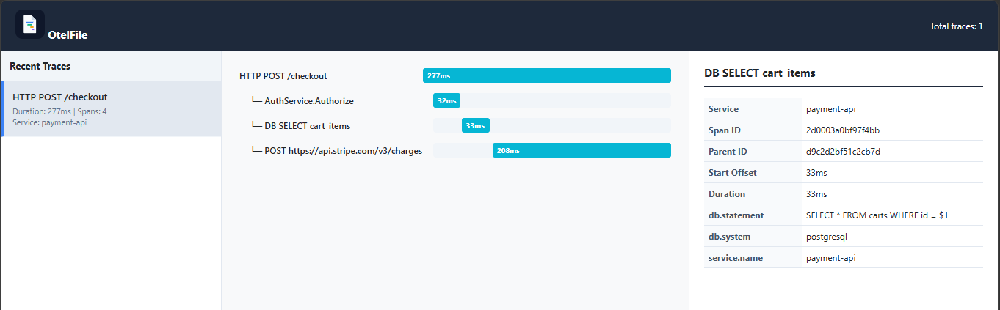

<p align="center">
  
</p>

<p align="center">
  <strong>Zero-backend local tracing for active development and endpoint testing.</strong>
</p>

<p align="center">
  <a href="https://pkg.go.dev/github.com/mukailasam/otelfile"></a>
  <a href="https://github.com/mukailasam/otelfile/blob/main/LICENSE"></a>
</p>

## The Problem: Blindness vs. Bloat

During the local development phase, when you are manually testing endpoints via `curl`, Postman, or clicking through a local UI, you usually face a tough choice for observability:

1. **Developer Blindness:** Run without tracing, missing out on understanding complex parent-child span trees, database execution, and internal network latencies.
2. **Developer Bloat:** Force your machine to run a heavy Docker Compose stack containing Jaeger, Tempo, or an OpenTelemetry Collector. This consumes CPU, eats up memory, and introduces tedious port and network configuration.

## The Solution: otelfile

`otelfile` is a lightweight, zero-dependency OpenTelemetry span exporter for Go. It behaves exactly like logging to a file.

Instead of routing trace streams to an external network or collector database, `otelfile` writes and appends your spans directly into a single, highly interactive **`trace.html`** file in your project directory in real-time.

To inspect your code's path, you don't boot up a backend. You simply open the HTML document directly in your browser.

## Features

- **Zero Dependency:** No collectors, no Docker, and no cloud databases.
- **Real-Time Updates:** The HTML file updates on every span batch export. Keep `trace.html` open in a browser tab to watch your live execution timelines.
- **Multi-Trace Sidebar:** Tracks and groups historical requests. You can trigger several endpoints and inspect each request separately in the visual list.
- **Rolling Trace Limit:** Keeps a configurable limit of traces (e.g., last 1000 traces) to ensure the file size remains compact and fast.
- **Highly Portable:** Sharing a trace with a colleague is as simple as sending them the generated `trace.html` file via Slack, email, or attaching it to a GitHub Pull Request.

## Installation

```bash
go get github.com/yourusername/otelfile
```

## Quick Start

```go

// initTracer initializes the OpenTelemetry pipeline using otelfile as the local exporter
func initTracer(serviceName string, filePath string) (*sdktrace.TracerProvider, func(context.Context) error, error) {
	if serviceName == "" {
		serviceName = "unknown_service"
	}

	// Create our file-based exporter (keeps a rolling log of 200 traces)
	exporter := otelfile.NewFileExporter(filePath, 200)

	// Build the resource matching semconv patterns and SchemaURL correctly
	res, err := resource.New(context.Background(),
		resource.WithSchemaURL(semconv.SchemaURL), // Correctly passes the schema URL
		resource.WithAttributes(
			semconv.ServiceName(serviceName),
		),
	)
	if err != nil {
		return nil, nil, err
	}

	// Register the exporter with the correct SimpleSpanProcessor setup
	tp := sdktrace.NewTracerProvider(
		sdktrace.WithSpanProcessor(sdktrace.NewSimpleSpanProcessor(exporter)), // Correct method signature
		sdktrace.WithResource(res),
	)

	// Set global tracer provider
	otel.SetTracerProvider(tp)

	// Establish Text Map Propagators (critical for context parsing across requests)
	otel.SetTextMapPropagator(
		propagation.NewCompositeTextMapPropagator(
			propagation.TraceContext{},
			propagation.Baggage{},
		),
	)

	// Return the provider and a safe shutdown function
	shutdownFunc := func(ctx context.Context) error {
		if tp != nil {
			return tp.Shutdown(ctx)
		}
		return nil
	}

	return tp, shutdownFunc, nil
}
```

## The Local Development Loop

Once integrated, otelfile makes manual endpoint testing visual and immediate:

### Run your local application:

```bash
go run main.go
```

### Open the generated file in your default browser:

- macOS: open trace.html
- Linux: xdg-open trace.html
- Windows: start trace.html

### Trigger your endpoints:

```bash
curl http://localhost:8080/checkout
```

</br>

**Refresh the page:** Your new request, along with its full distributed span structure, is immediately indexed and rendered in your browser.
</br>

**for example**

<p align="center">
  
</p>

### Rolling Eviction Strategy

Trace files can grow rapidly if an application runs for extended periods. To mitigate memory growth and prevent large file sizes from crashing your browser:

- otelfile organizes spans inside the file by unique TraceID.
- When the number of unique traces exceeds your configured maxTraces parameter (e.g., 100), the oldest trace and all of its associated spans are discarded.
- This ensures your trace.html file remains lightweight (typically < 1MB) and responsive on your local machine.

## Contributing

Feel free to open an Issue or submit a Pull Request!

## License

OtelFile is released under the MIT license. See [LICENSE](LICENSE)
